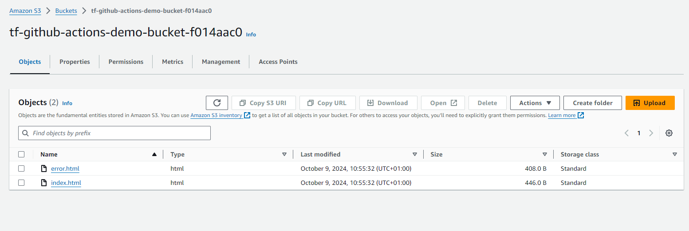
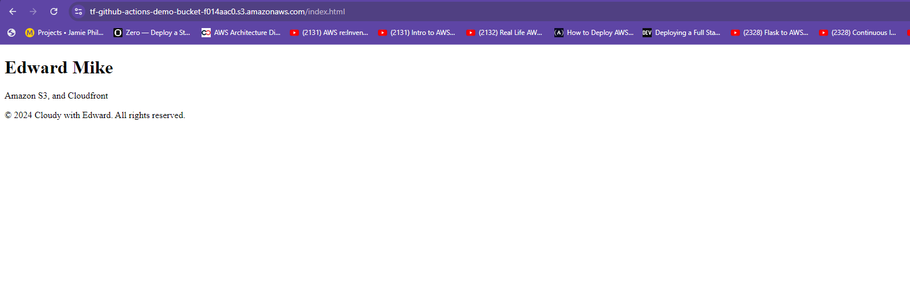
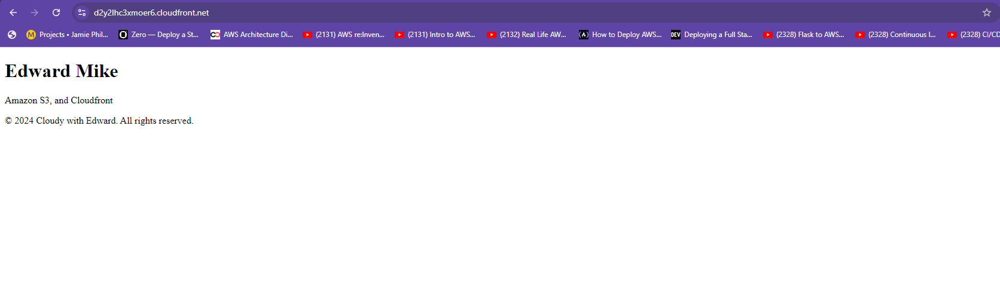

# Static Website Deployment with AWS S3, CloudFront, Terraform, and GitHub Actions

This project automates the deployment of a static website to AWS S3 and serves it via CloudFront. It utilizes Terraform for Infrastructure as Code (IaC) and GitHub Actions for Continuous Integration and Continuous Deployment (CI/CD). This setup ensures a streamlined process for hosting and maintaining your website on AWS, with minimal manual intervention.

## Table of Contents

- [Overview](#overview)
- [Architecture](#architecture)
- [Technologies Used](#technologies-used)
- [Prerequisites](#prerequisites)
- [Setup](#setup)
  - [AWS Credentials](#aws-credentials)
  - [Terraform Setup](#terraform-setup)
  - [GitHub Actions CI/CD](#github-actions-cicd)
- [Usage](#usage)
- [Results](#results)

## Overview

This repository demonstrates how to automate the deployment of a static website to AWS using S3 for storage and CloudFront for global content delivery. The infrastructure is defined using Terraform, and deployments are automatically handled through GitHub Actions whenever changes are pushed to the repository.

## Architecture

1. **AWS S3**: Hosts the static website files.
2. **AWS CloudFront**: Distributes the website globally via a CDN, improving load times and availability.
3. **Terraform**: Provisions and manages the AWS resources.
4. **GitHub Actions**: Automates the CI/CD pipeline to deploy updates to the website when changes are committed.

 <!-- Replace with a valid link to your architecture diagram -->

## Technologies Used

- **AWS S3** for static file hosting.
- **AWS CloudFront** for content delivery.
- **Terraform** for managing the infrastructure as code.
- **GitHub Actions** for automating CI/CD.

## Prerequisites

Ensure you have the following before starting:

- An **AWS account** with permissions to create S3 buckets, CloudFront distributions, and manage IAM roles.
- **Terraform** installed on your local machine ([Installation Guide](https://learn.hashicorp.com/tutorials/terraform/install-cli)).
- A **GitHub repository** with AWS credentials added as GitHub Secrets:
  - `AWS_ACCESS_KEY_ID`
  - `AWS_SECRET_ACCESS_KEY`
  - `AWS_REGION`
- A basic static website (HTML, CSS, JavaScript) ready to be deployed.

## Setup

### AWS Credentials

1. Create a new AWS IAM user with programmatic access and the following credentials:
   - **AWS_ACCESS_KEY_ID**
   - **AWS_SECRET_ACCESS_KEY**

### Terraform Setup

1. **Configure Terraform backend** for remote state management using S3. In your `providers.tf`, add the following:

    ```hcl
    backend "s3" {
      bucket = "tf-state-s3-hosting-bucket"   # Replace with your S3 bucket name
      key    = "terraform/state.tfstate"      # Terraform state file path
      region = "us-east-1"                    # Your AWS region
    }
    ```

2. **Define the necessary infrastructure** in separate Terraform files:
   - `s3.tf`: Manages S3 bucket creation and static website configuration.
   - `cloudfront.tf`: Manages CloudFront distribution settings for global delivery.

### GitHub Actions CI/CD

1. **Set up GitHub Secrets**:

   Go to your GitHub repository's **Settings** > **Secrets** and add the following secrets:
   - `AWS_ACCESS_KEY_ID`
   - `AWS_SECRET_ACCESS_KEY`
   - `AWS_REGION`

2. **GitHub Actions Workflow**:

   The project includes a `.github/workflows/terraform-cd.yml` file that defines the continuous deployment (CD) pipeline. The workflow is triggered on pushes to the `master` branch and performs the following actions:
   - Installs Terraform.
   - Validates and applies the Terraform configuration.
   - Syncs static website files to the S3 bucket.

The `.github/workflows/terraform-cleanup.yml` file defines the workflow to tear down the infrastructure. This workflow is triggered manually.

3. **Deploying Changes**:

   Push changes to the `master` branch if contents in the `website/` directory are modified:

   ```bash
   git add .
   git commit -m "Update website content"
   git push origin master
   ```

   GitHub Actions will automatically deploy the updated website to AWS.

   Event condition 
   ```bash
   on: 
   push:
      branches: [master,main]
      paths:
        - 'website/**' 
   ```

## Usage

- After successful deployment, your website will be accessible via both the **CloudFront** and **S3 bucket** URLs.
- To update the website, make changes to the repository, then commit and push them. GitHub Actions will handle the redeployment.

## Results

Here are the results from my deployment:

- **S3 Bucket Files**:

  

- **S3 Website Endpoint**:

  ```
  http://tf-github-actions-demo-bucket-f014aac0.s3-website-us-east-1.amazonaws.com
  ```

  

- **CloudFront Distribution Endpoint**:

  ```
  https://d2y2lhc3xmoer6.cloudfront.net
  ```

  


## Next Steps
- Setup custom routing with Route 53
